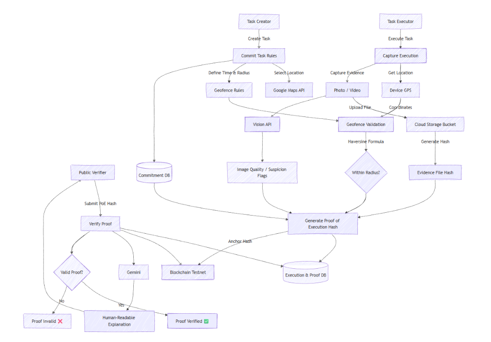
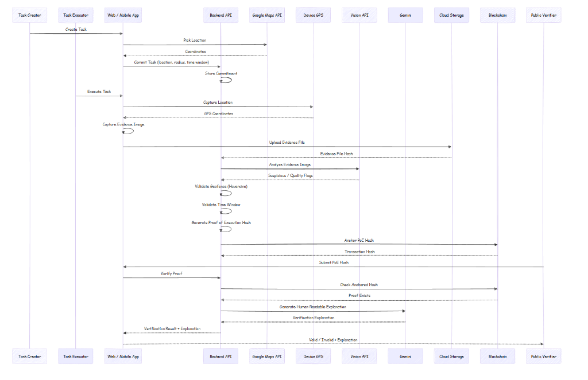

https://github.com/user-attachments/assets/5ba283f5-b5e0-4cb1-b168-31db7f4ef829
# Veritas | Re-imagining Trust in Real-World Tasks

**Veritas** is a decentralized verification protocol that allows enterprises to cryptographically verify that real-world tasks—from AI computations to physical logistics—were executed correctly, at the right location, and within the required timeframe.

---

## 🚨 Problem Statement

In an increasingly automated world, **trust is defined by opacity**:
*   **Physical Verification Gap**: Logistics and gig-economy platforms rely on easily spoofable GPS data.
*   **Lack of Auditability**: Current solutions rely on centralized logs that can be tampered with or retroactively edited.

We need a system where **verification is intrinsic**, relying on math and cryptography rather than blind faith in a centralized provider.

---

## 💡 Our Solution

**Veritas** introduces **Proof of Execution (PoE)**: a cryptographically secure receipt that binds a task's constraints (location, time, logic) to its execution evidence.

By combining Trusted Execution environments (simulated), Geofencing, and AI-powered evidence analysis, we generate an immutable proof anchored on the blockchain. This allows anyone to verify the integrity of a task **without needing to trust the executor**.


Live video demo :  https://drive.google.com/file/d/1H8LgfHFExOekvyQuVP1XkVu1CgOg5TXo/view?usp=drive_link

### 🛠 Google Technologies Used

*   **Google Gemini**: Acts as the "Supreme Judge" for complex verification logic, explaining *why* a proof is valid or suspicious in plain English.
*   **Google Cloud Firestore**: High-performance NoSQL database for real-time synchronization of tasks and proofs.
*   **Firebase Authentication**: Secure, drop-in identity solution ensuring only authorized peers can commit tasks.
*   **Google Cloud Storage**: Secure, scalable object storage for evidence images and immutable audit trails.
*   **Google Maps Platform**: Provides precise geocoding and visual context for location-based verification.
*   **Google Cloud BigQuery**: Powering our real-time analytics engine to detect anomalies and track verification metrics at scale.
*   **Google Cloud Vision API**: Analyzing image evidence for content verification, safety checks (SafeSearch), and optical character recognition (OCR) to validate physical tasks.

---

## ✨ Key Features

1.  **Proof of Execution (PoE)**: Generates a SHA-256 hash chaining execution time, location, and evidence.
2.  **Trustless Verification Console**: A public interface allowing anyone to audit proofs against the blockchain ledger.
3.  **Smart Geofencing**: Enforces strict radius checks (e.g., must be within 200m of the target) using the Haversine formula.
4.  **AI Fraud Detection**: Uses Gemini and Vision API to flag "spoofed" or unsafe evidence images automatically.
5.  **Immutable Ledger**: Anchors every valid proof to a local Hardhat testnet (simulating Ethereum/Polygon) for tamper-proof finality.

---

## 🏗 System Architecture

### High-Level Flow


### Execution Sequence


## 🚀 Getting Started

### Prerequisites
*   Node.js v18+
*   Google Cloud Project (with Vision & BigQuery APIs)
*   Firebase Project

### Installation

1.  **Clone the repo**
    ```bash
    git clone https://github.com/your-username/veritas.git
    cd veritas
    ```

2.  **Setup Backend**
    ```bash
    cd backend
    npm install
    # Configure .env with your Google Cloud & Firebase credentials
    npm start
    ```

3.  **Setup Frontend**
    ```bash
    cd frontend
    npm install
    npm run dev
    ```

4.  **Deploy Smart Contracts**
    ```bash
    cd backend
    npx hardhat run scripts/deploy.cjs --network localhost
    ```

    
